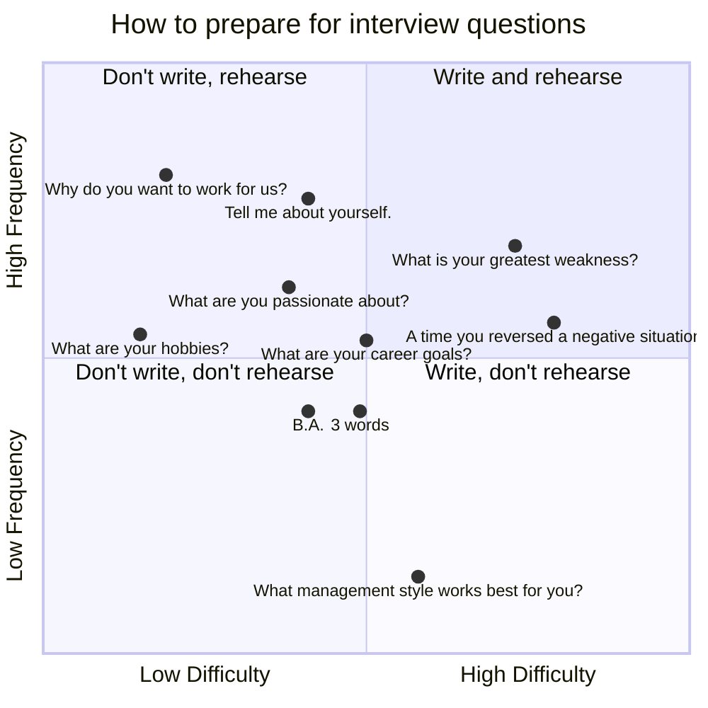

<!--
author:   Dr. Mark Jacob
email: mark.jacob@iuz.tu-freiberg.de
version:  0.0.1
language: en
narrator: UK English Female
comment: Content of week 3 WS 2023/2024
icon: https://upload.wikimedia.org/wikipedia/commons/thumb/e/e8/TUBAF_Logo.svg/800px-TUBAF_Logo.svg.png
script:   https://cdn.jsdelivr.net/npm/mermaid@10.5.0/dist/mermaid.min.js
import: https://raw.githubusercontent.com/liaScript/mermaid_template/master/README.md
-->

# Interview question preparation

